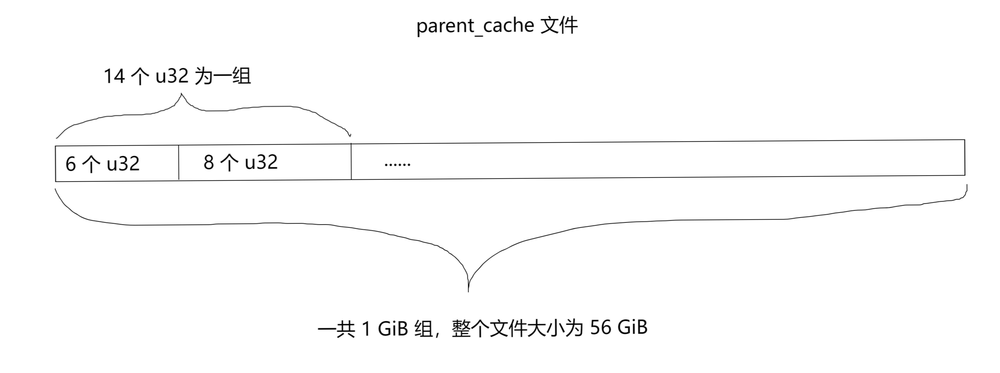
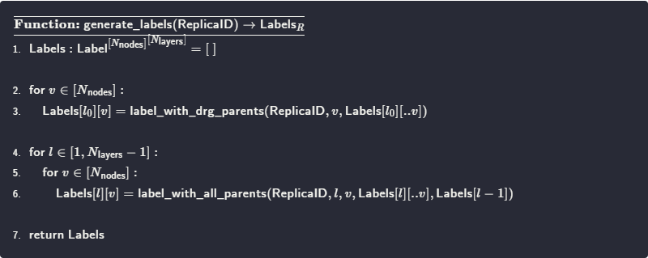
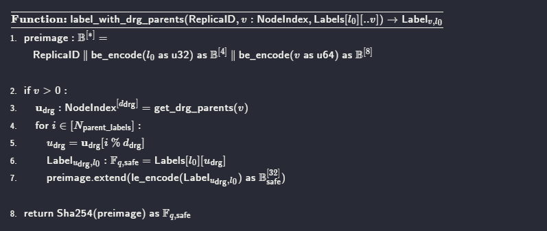
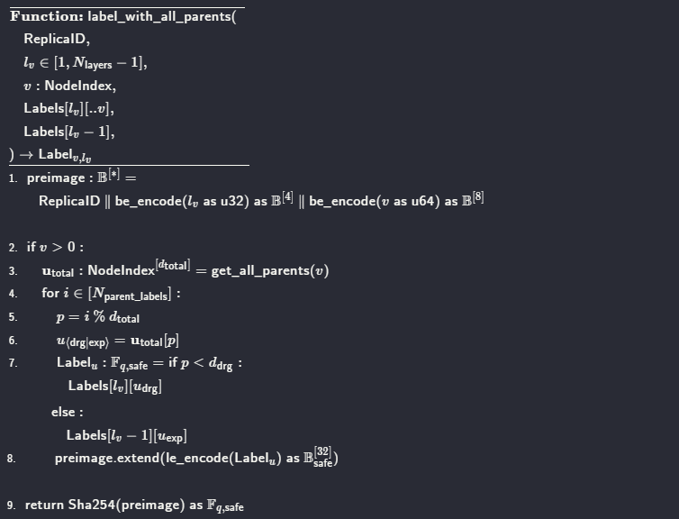

# 规范
在规范中，P1、P2 的定义与 rust 源码的实现略有不同，主要的区别只是步骤的划分不同而已，比如规范中的 P1 包含了源码中的 P2 的大部分计算步骤，为了方便理解和优化，本文的步骤划分与源码一致。
> - **Sealing preCommit phase 1.** In this phase, PoRep SDR encoding and replication takes place.
> - **Sealing preCommit phase 2.** In this phase, Merkle proof and tree generation is performed using the Poseidon hashing algorithm.

## 生产环境
P1 涉及的文件主要有两种:
```
在 cache/s-t**** 目录下：
sc-02-data-layer-1.dat
sc-02-data-layer-2.dat
sc-02-data-layer-3.dat
sc-02-data-layer-4.dat
sc-02-data-layer-5.dat
sc-02-data-layer-6.dat
sc-02-data-layer-7.dat
sc-02-data-layer-8.dat
sc-02-data-layer-9.dat
sc-02-data-layer-10.dat
sc-02-data-layer-11.dat
```
这 11 个 layer 文件是 P1 的主要产物，每个扇区都会生成这 11 个文件。layer 文件的数据结构非常简单，每 32 个字节在规范中称为一个 Label，在源码中称为 node (后面称为 Label)，一共 1 GiB 个 Label，所以每个 layer 文件大小为 32 GiB。
```
在 filecoin-parents 目录下（所有扇区共用）：
v28-sdr-parent-21981246c370f9d76c7a77ab273d94bde0ceb4e938292334960bce05585dc117.cache
```
parent_cache 是一个重要的辅助文件，所有扇区共用。
parent_cache 文件内容的数据结构如下图，其中的每一个 u32 都由一个以 Replica_id 与当前分组的索引 i 拼接作为 seed 的随机数生成器生成，可以简单地理解为 parent_cache 中每个 u32 都是随机生成的。其中每个分组的前 6 个 u32 被称为 drg_parents, 后 8 个 u32 被称为 expand_parents。对于第 i (i > 0) 组的前 6 个数字 v 都满足 v < i；对于后 8 个数字 v，都满足 v < 1 GiB = 2<sup>30</sup>。由于这个文件只需要生成一次，没有优化空间，只需要知道它的数据结构和作用即可，下面会详细说明它的作用。
规范中的位置：https://spec.filecoin.io/#section-algorithms.sdr.drg
源码的位置为：
**drg_parents:** storage_proofs::core::drgraph::BucketGraph::parents()
**expaned_parents:** storage_proofs::porep::stacked::vanilla::graph::StackedGraph::generate_expanded_parents()



## 规范解读
源码中的 P1 在规范中被称为 Labeling, generate_labels 将生成 layer0 - layer10 共 11 层 layer，也就是上面提到的 11 个 layer 文件（ layer0 就是 layer-1 文件，依此类推）。



**代码解读：**
- **伪码语法：**
变量类型在冒号后面，类型右上角标注表示这是一个固定大小的数组，如第一行 Labels 的定义，表示这是一个有 N<sub>nodes</sub> 列 N<sub>layers</sub> 行的二维数组。
- **常量及参数：**
ReplicaID: 一个随机生成的 ID，对每个扇区是独特的
N<sub>nodes</sub> = 2<sup>30</sup> = 1 GiB
N<sub>layers</sub> = 11
- **line 1:** 定义一个 11 行 2<sup>30</sup> 列的 Lable 类型二维数组，这个数组的每一行对应一个 layer 文件，每个 Label 大小为 32 Byte
- **line 2-3:** 逐个生成第一层的所有 Label
- **line 4-6:** 按顺序生成剩下的 10 层 Label，注意调用的函数和第一层的不同, 区别在于第一层调用的函数名里有 drg_parents，而其他 10 层的是 all_parents，下面会解释这两者的区别

### 生成 Label 的两个函数
#### label_with_drg_parents()
由于 layer 0 没有上一层 layer，所以处理过程有一点特殊，同样地，每一层 layer 中索引 v = 0 的 Label 没有前面的 Label，处理也和后面的有所不同，这两点都在下面的算法伪码中有体现



**代码解读：**
- **参数及常量**

    N<sub>parent_labels</sub> = 37

    d<sub>drg</sub> = 6

- **line 1:** 将数组 ReplicaID 和层索引（行索引）和 node 索引（列索引）拼接起来，源码中的实现为：
    ```
    位置：// storage-proofs-porep/src/stacked/vanilla/utils.rs/prepare_block
    buf[..32].copy_from_slice(replica_id); // 拼接 replica_id
    buf[35] = (layer & 0xFF) as u8         // 拼接 layer (0..11)

    位置：// storage-proofs-porep/src/stacked/vanilla/create_label/multi.rs/fill_buffer
    let cur_node_swap = cur_node.to_be_bytes(); // Note switch to big endian
    buf[36..44].copy_from_slice(&cur_node_swap); // 拼接 Label 的列索引
    ```
- **line 2:** 索引为 0 时不处理
- **line 3:** 当前 Label 在 layer 中的索引为 v，get_drg_parents 函数会从 parent_cache 文件读取索引为 v 的**分组**的前 6 个u32。这 6 个u32 都保证小于 v。为了提高读取速度，源码中会把这个文件的部分或全部映射到内存中。
- **line 4-7:** 循环 N<sub>parent_labels</sub> = 37 次，按顺序从 u<sub>drg</sub> 数组中取一个索引（注意等号两边的 u<sub>drg</sub> 中的 u 是不一样的），因为这个索引的大小一定会小于 v，所以只会取到之前已经生成的 Label，这保证了每一层的 Label 必须按顺序生成，而无法并行计算。第 7 行，将取出的 Label 的 32 个字节转为小端序，并将最后两个的 bit 置为 0，然后再拼接到 preimage 上
- **line 8:** Sha254 其实是用 Sha256 处理 preimage, 生成固定 256 bit 长度的结果，并将最后两个 bit 置为 0

#### label_with_all_parents
除了索引为 0 的 layer，其他的 10 层都要从上一层的取 Label 来的生成的当前的 Label



**代码解读：**
- **参数及常量**

    N<sub>parent_labels</sub> = 37

    d<sub>total</sub> = 14

    Labels[l<sub>v</sub> - 1]: 上一层 layer

- **line 1:** 和 label_with_drg_parents 一样，拼接相关的数据
- **line 2:** 跳过索引为 0 的Label
- **line 3:** 获取 parent_cache 中索引为 v 的整个分组，共 14 个 u32
- **line 4-8:** 循环 N<sub>parent_labels</sub> = 37 次，以 i 对 d<sub>total</sub> 取余，然后从分组中取一个 u32。当 i < 6，处理过程与 layer 0 一致；否则，将取出的 u32 作为索引从上一层 layer 中取 1 个 Label，拼接到 preimage 后
- **line 9:** 与 layer 0 的处理一致

## P1 优化的思路
由于 P1 串行计算的要求，提高并发数对计算速度提高很有限，更好的思路应该是根据当前的计算瓶颈调整参数和算法，尽可能提高同时运行的 p1 扇区数。这样可能在单个扇区的计算速度有一点损失，但能提高整体的产量。

1. **根据硬件调整环境变量**

2. **硬盘空间换内存空间**
如果瓶颈是内存，那么磁盘空间换内存空间可以提高同时运行 p1 的数量。这个思路来自技术交流群主 【TEARS】，具休的思路是：
    > 因为每个 layer 计算用的 parent_cache 都是固定的，且除了 layer-0 之外的所有 layer 中的每个 Label 都需要从上一层 layer 中以 parent_cache 为索引取 8 个 Label，所以我们可以在计算完 layer-A 后，把 layer-(A+1) 每个 Label 所需的 8 个 Label 先取出并按顺序存入磁盘。在计算 layer-(A+1) 时直接按顺序分段读取即可。这样 layer-A 就不用驻留在内存中。

忽略分段的大小，这个方案可以降低 32 GiB 内存，但也会占用额外的 8 * 32 = 256 GiB 硬盘空间，相应地，会带来额外的 256 * 10 * 2 GiB 的 IO 流量，这可能会使 IO 成为瓶颈，**有可能**（未测试，但从实际机器的 IO 速度计算来看，有这个风险）降低整体的产量。

3. **手动绑定 CPU 核心**
